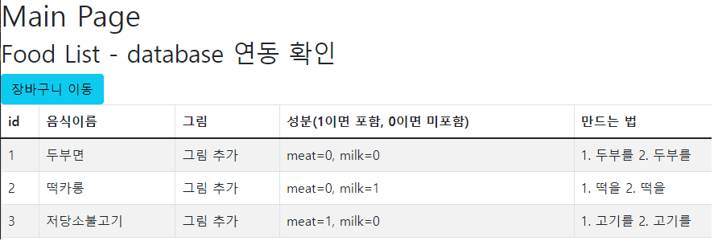

# 시작방법(Vscode)

yarn upgrade -> yarn install -> project최상위 directory에서 -> yarn start

오류나면 package 재설치 -> yarn install --check-files

혹은 node_module 폴더(client폴더에 있는 것도 함께)  삭제 후 yarn install

# 테스트 화면

# 추가 설명
서버 port: 5000
클라이언트 port: 3000

프론트, 벡엔드 연동을 위해 react의 axios사용
=> 따라서 url path는 /api로 시작해야 함(client/src/setupProxy.js 참고)
