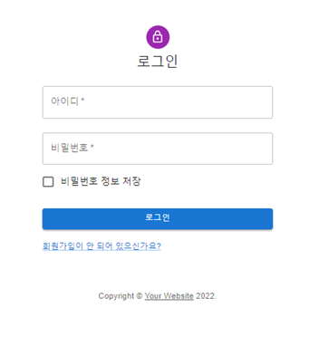

# 2022-01-OSSP1-KBJ
>2022-01 공개SW프로젝트 KBJ팀
>
>헬시 플레저 음식에 대한 정보를 제공하고, 협업 필터링을 사용한 추천 시스템으로 사용자에게 알맞은 헬시 플레저 음식을 추천하는 서비스
 
 

# 시작방법

* yarn upgrade -> yarn install -> project최상위 directory에서 -> yarn start

 
 

# 동작 과정

### 1. Main page

- localhost:3000 으로 main page 접속
 
 

### 2. 음식 정보 조회

- 음식을 클릭하면 정보 조회 가능
 
 

### 3. 회원가입 및 로그인

- 추천 시스템을 사용하기 위해 회원가입 후 로그인
 
 

### 4. 레시피 담기

- 메인 페이지나 레시피 정보 페이지에서 장바구니로 관심있는 음식 추가
 
 

### 5. 장바구니 페이지(추천 페이지)

- 장바구니 페이지로 이동하면 담은 음식들과 사용자에게 추천하는 음식들을 볼 수 있음
 
 

## 참고

AWS RDS로 DB를 관리하기 때문에 이 RDS가 닫히면 동작 불가

> 2022-06-23 RDS 닫음
